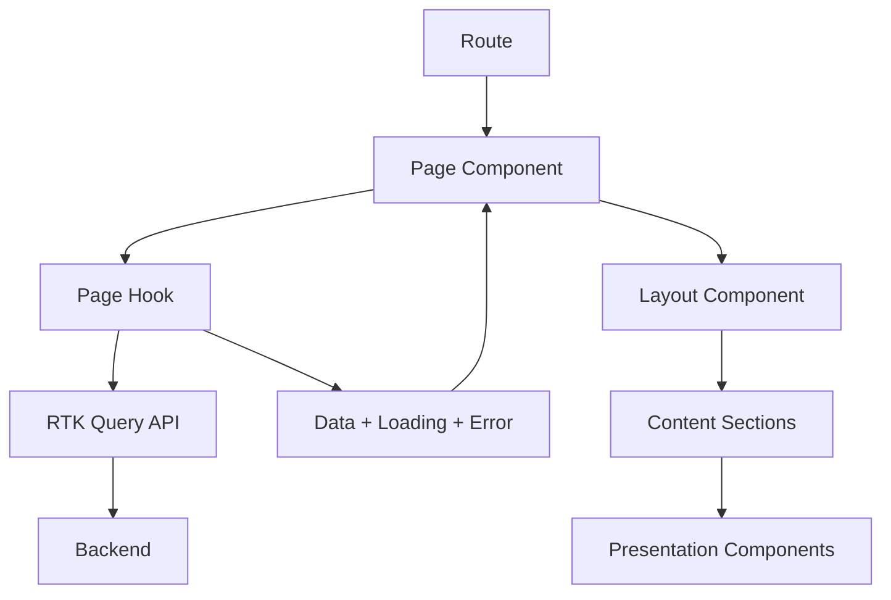

# Design Document: Page Architecture Refactor

## Overview

This design establishes a new page architecture that separates concerns into distinct layers: layout, data fetching, business logic, and presentation. The architecture enables granular lazy loading of page sections, provides reusable layout components, and aligns with the feature-based directory structure.

The refactor addresses current issues where pages like `ViewMarketListing.tsx` and `ViewOrg.tsx` mix multiple concerns, making them difficult to maintain, test, and optimize. The new architecture will:

- Extract layout into reusable components
- Move data fetching into custom hooks
- Enable lazy loading of independent content sections
- Provide section-specific skeleton loading states
- Migrate page logic into feature modules

This design maintains backward compatibility during migration, allowing incremental adoption across the codebase.

## Architecture

### Layered Architecture

The page architecture consists of four distinct layers:

```
┌─────────────────────────────────────────┐
│         Page Component (Route)          │
│  - Route orchestration                  │
│  - Layout selection                     │
│  - Hook composition                     │
└─────────────────────────────────────────┘
                  │
    ┌─────────────┼─────────────┐
    │             │             │
    ▼             ▼             ▼
┌─────────┐  ┌─────────┐  ┌─────────┐
│ Layout  │  │  Hooks  │  │ Content │
│         │  │         │  │ Sections│
└─────────┘  └─────────┘  └─────────┘
```

**Layer 1: Page Component**
- Lives in `src/pages/`
- Minimal orchestration logic only
- Selects appropriate layout
- Composes hooks for data fetching
- Maps data to content sections
- Handles routing concerns (params, navigation)

**Layer 2: Layout Components**
- Lives in `src/components/layout/`
- Provides consistent page structure
- Handles metadata, breadcrumbs, containers
- No business logic or data fetching
- Accepts content via children props

**Layer 3: Page Hooks**
- Lives in `src/features/{domain}/hooks/`
- Encapsulates data fetching logic
- Composes multiple API queries
- Returns data, loading states, errors
- Provides refetch functions

**Layer 4: Content Sections**
- Lives in `src/features/{domain}/components/`
- Lazy-loadable presentation components
- Receives data via props
- Focuses on rendering UI
- Includes corresponding skeleton component

### Directory Structure

```
src/
├── pages/
│   └── {domain}/
│       └── PageName.tsx          # Thin orchestration only
├── features/
│   └── {domain}/
│       ├── api/
│       │   └── {domain}Api.ts    # RTK Query endpoints
│       ├── hooks/
│       │   └── usePage{Name}.ts  # Page-specific hooks
│       ├── components/
│       │   ├── {Name}Section.tsx
│       │   ├── {Name}Section.skeleton.tsx
│       │   └── {Name}View.tsx
│       ├── domain/
│       │   └── types.ts
│       └── index.ts
└── components/
    └── layout/
        ├── StandardPageLayout.tsx
        ├── DetailPageLayout.tsx
        ├── FormPageLayout.tsx
        └── LazySection.tsx
```

### Data Flow



## Components and Interfaces

### Lazy Loading Strategy

**Critical Design Principle:** Only Content_Section components are lazy loaded. Layout components, skeleton components, and the LazySection wrapper itself are imported directly and available immediately.

**What IS lazy loaded:**
- Content_Section components (e.g., MarketListingDetails, OrgInfo)
- Feature-specific view components with business logic
- Components that can be code-split into separate bundles

**What is NOT lazy loaded:**
- Layout components (StandardPageLayout, DetailPageLayout, FormPageLayout)
- Skeleton components (e.g., MarketListingDetailsSkeleton)
- LazySection wrapper component
- Page components themselves
- Shared UI components (buttons, inputs, etc.)

This ensures that the page structure and loading states are available immediately, providing instant visual feedback to users while content loads in the background.

### StandardPageLayout Component

A reusable layout component for standard pages with breadcrumbs, header, and content area.

```typescript
interface StandardPageLayoutProps {
  // Metadata
  title?: string
  canonicalUrl?: string
  
  // Breadcrumbs
  breadcrumbs?: Array<{ label: string; href?: string }>
  
  // Header
  headerTitle?: React.ReactNode
  headerActions?: React.ReactNode
  
  // Layout configuration
  sidebarOpen?: boolean
  sidebarWidth?: number
  maxWidth?: 'xs' | 'sm' | 'md' | 'lg' | 'xl' | false
  noFooter?: boolean
  noSidebar?: boolean
  noMobilePadding?: boolean
  
  // Content
  children: React.ReactNode
  
  // Loading and error states
  isLoading?: boolean
  error?: unknown
  skeleton?: React.ReactNode
}

function StandardPageLayout(props: StandardPageLayoutProps): ReactElement
```

**Responsibilities:**
- Render Page metadata component
- Render breadcrumbs if provided
- Render header with title and actions
- Render ContainerGrid with configuration
- Handle loading state with skeleton
- Handle error states (404, error page)
- Render children content

### DetailPageLayout Component

Specialized layout for entity detail pages (view listing, view org, view profile).

```typescript
interface DetailPageLayoutProps extends StandardPageLayoutProps {
  // Back navigation
  backButton?: boolean
  backTo?: string
  
  // Entity-specific
  entityTitle?: string
  entitySubtitle?: string
  entityActions?: React.ReactNode
}

function DetailPageLayout(props: DetailPageLayoutProps): ReactElement
```

**Responsibilities:**
- All StandardPageLayout responsibilities
- Render back button if configured
- Render entity title with subtitle
- Position entity actions prominently

### FormPageLayout Component

Specialized layout for create and edit pages.

```typescript
interface FormPageLayoutProps extends StandardPageLayoutProps {
  // Form-specific
  formTitle: string
  backButton?: boolean
  submitButton?: React.ReactNode
  cancelButton?: React.ReactNode
}

function FormPageLayout(props: FormPageLayoutProps): ReactElement
```

**Responsibilities:**
- All StandardPageLayout responsibilities
- Render form title with back button
- Position form actions (submit, cancel)
- Use narrower max width (typically 'lg')

### LazySection Component

A wrapper component that handles lazy loading of content sections with skeleton states.

```typescript
interface LazySectionProps {
  // Lazy-loaded component
  component: React.LazyExoticComponent<React.ComponentType<any>>
  
  // Props to pass to the component
  componentProps?: Record<string, any>
  
  // Loading state
  skeleton: React.ComponentType
  
  // Error handling
  errorFallback?: React.ComponentType<{ error: Error }>
  
  // Grid configuration
  gridProps?: GridProps
}

function LazySection(props: LazySectionProps): ReactElement
```

**Responsibilities:**
- Wrap lazy component in React.Suspense
- Display skeleton during loading
- Wrap in error boundary
- Display error fallback on failure
- Apply grid props to container

**Important:** LazySection itself is NOT lazy loaded. It is imported directly and available immediately. Only the `component` prop (the actual content section) is lazy loaded. The `skeleton` component is also imported directly and rendered immediately while the content loads.

### Page Hook Pattern

Page hooks encapsulate all data fetching logic for a page.

```typescript
interface UsePageResult<T> {
  data: T | undefined
  isLoading: boolean
  isFetching: boolean
  error: unknown
  refetch: () => void
}

function usePageMarketListing(id: string): UsePageResult<MarketListingPageData> {
  const listing = useGetMarketListingQuery(id)
  const relatedListings = useGetRelatedListingsQuery(
    { itemId: listing.data?.item_id },
    { skip: !listing.data }
  )
  
  return {
    data: listing.data ? {
      listing: listing.data,
      relatedListings: relatedListings.data
    } : undefined,
    isLoading: listing.isLoading,
    isFetching: listing.isFetching || relatedListings.isFetching,
    error: listing.error || relatedListings.error,
    refetch: () => {
      listing.refetch()
      relatedListings.refetch()
    }
  }
}
```

**Responsibilities:**
- Compose multiple RTK Query hooks
- Aggregate loading states
- Aggregate error states
- Provide unified refetch function
- Transform/combine data if needed

### Content Section Pattern

Content sections are lazy-loadable presentation components with corresponding skeletons.

```typescript
// Content section component (LAZY LOADED)
interface MarketListingDetailsProps {
  listing: MarketListing
  onUpdate?: () => void
}

function MarketListingDetails(props: MarketListingDetailsProps): ReactElement

// Corresponding skeleton (NOT LAZY LOADED - imported directly)
function MarketListingDetailsSkeleton(): ReactElement
```

**Responsibilities:**
- Receive all data via props
- Focus on presentation only
- No data fetching or business logic
- Provide matching skeleton component

**Import Strategy:**
```typescript
// In page component:
import { LazySection } from '@/components/layout/LazySection'
import { MarketListingDetailsSkeleton } from '@/features/market/components/MarketListingDetails.skeleton'

// Lazy load the actual content
const MarketListingDetails = lazy(() => import('@/features/market/components/MarketListingDetails'))

// Use in render:
<LazySection
  component={MarketListingDetails}
  skeleton={MarketListingDetailsSkeleton}
  componentProps={{ listing: data.listing }}
/>
```

Note: The skeleton is imported directly (not lazy loaded) so it's available immediately to show while the content section loads.

## Data Models

### Page Component Structure

```typescript
// Example: Refactored ViewMarketListing page
function ViewMarketListing() {
  const { id } = useParams<{ id: string }>()
  const { t } = useTranslation()
  const pageData = usePageMarketListing(id!)
  
  return (
    <DetailPageLayout
      title={pageData.data?.listing.details?.title}
      canonicalUrl={pageData.data?.listing && formatCompleteListingUrl(pageData.data.listing)}
      breadcrumbs={[
        { label: t("market.title"), href: "/market" },
        { label: pageData.data?.listing.details?.title || t("market.viewMarketListing") }
      ]}
      entityTitle={pageData.data?.listing.details?.title}
      entityActions={
        <Link to="/market/cart">
          <Button startIcon={<ShoppingCartRoundedIcon />}>
            {t("marketActions.myCart")}
          </Button>
        </Link>
      }
      isLoading={pageData.isLoading}
      error={pageData.error}
      skeleton={<MarketListingViewSkeleton />}
      sidebarOpen={true}
      maxWidth="xl"
    >
      {pageData.data && (
        <CurrentMarketListingContext.Provider value={[pageData.data.listing, pageData.refetch]}>
          <LazySection
            component={lazy(() => import('../../features/market/views/MarketListingView'))}
            componentProps={{}}
            skeleton={MarketListingDetailsSkeleton}
          />
        </CurrentMarketListingContext.Provider>
      )}
    </DetailPageLayout>
  )
}
```

### Layout Component Configuration

```typescript
interface LayoutConfig {
  // Which layout to use
  layout: 'standard' | 'detail' | 'form'
  
  // Sidebar configuration
  sidebar: {
    enabled: boolean
    width?: number
  }
  
  // Container configuration
  container: {
    maxWidth: 'xs' | 'sm' | 'md' | 'lg' | 'xl' | false
    noMobilePadding?: boolean
  }
  
  // Footer configuration
  footer: {
    enabled: boolean
  }
}
```

### Section Loading State

```typescript
interface SectionLoadingState {
  sectionId: string
  isLoading: boolean
  error: Error | null
  data: unknown
}

interface PageLoadingState {
  sections: Record<string, SectionLoadingState>
  isAnyLoading: boolean
  hasAnyError: boolean
}
```

### Migration Mapping

```typescript
interface PageMigrationPlan {
  // Original page location
  originalPath: string
  
  // Target feature module
  targetFeature: string
  
  // Components to create
  components: {
    pageHook: string
    contentSections: string[]
    skeletons: string[]
  }
  
  // Layout to use
  layout: 'standard' | 'detail' | 'form'
  
  // Migration complexity
  complexity: 'simple' | 'moderate' | 'complex'
}
```


## Correctness Properties

A property is a characteristic or behavior that should hold true across all valid executions of a system—essentially, a formal statement about what the system should do. Properties serve as the bridge between human-readable specifications and machine-verifiable correctness guarantees.

### Property 1: Layout components render required elements

*For any* StandardPageLayout with valid props, the rendered output should contain page metadata, breadcrumbs (if provided), header, and container elements.

**Validates: Requirements 2.2**

### Property 2: Layout configuration is applied correctly

*For any* StandardPageLayout with sidebar and container configuration props, the rendered component should apply those configurations without errors and reflect them in the DOM structure.

**Validates: Requirements 2.3, 2.7, 10.4**

### Property 3: DetailPageLayout includes navigation elements

*For any* DetailPageLayout with backButton prop set to true, the rendered output should include a back button element.

**Validates: Requirements 2.5**

### Property 4: Lazy sections display skeletons during loading

*For any* LazySection with a lazy-loaded component and skeleton, the skeleton should be displayed during the loading phase before the actual component renders.

**Validates: Requirements 3.2, 8.2**

### Property 5: Error isolation between content sections

*For any* page with multiple Content_Sections where one section throws an error, the other sections should continue to render successfully without being affected by the failing section.

**Validates: Requirements 3.4, 7.4**

### Property 6: Page hooks return required properties

*For any* Page_Hook implementation, the returned object should include data, isLoading, isFetching, error, and refetch properties with appropriate types.

**Validates: Requirements 5.2, 5.5**

### Property 7: Page hooks expose error information

*For any* Page_Hook when an underlying API query returns an error, the hook should expose that error in its error property.

**Validates: Requirements 5.3**

### Property 8: 404 errors trigger navigation

*For any* page component that receives a 404 error from data fetching, the system should navigate to the /404 route.

**Validates: Requirements 7.1**

### Property 9: Server errors display error page

*For any* page component that receives a server error (5xx) from data fetching, the system should display an error page component.

**Validates: Requirements 7.2**

### Property 10: Errors are logged for debugging

*For any* error that occurs in a Content_Section or during data fetching, the error should be logged to the console or error tracking system.

**Validates: Requirements 7.5**

### Property 11: LazySection accepts and uses skeleton prop

*For any* LazySection component with a valid skeleton component prop, that skeleton should be rendered during the loading phase.

**Validates: Requirements 8.4**

### Property 12: Breadcrumbs render all provided items

*For any* Layout_Component with a breadcrumbs array prop, all items in the array should be rendered in the breadcrumb navigation.

**Validates: Requirements 9.1**

### Property 13: Current page is last breadcrumb

*For any* Layout_Component with breadcrumbs, the last item in the breadcrumb array should represent the current page and should not be a link.

**Validates: Requirements 9.2**

### Property 14: Empty breadcrumbs are not rendered

*For any* Layout_Component when the breadcrumbs prop is undefined or an empty array, no breadcrumb navigation should be rendered.

**Validates: Requirements 9.5**

### Property 15: Document title is set from props

*For any* Layout_Component with a title prop, the document.title should be updated to reflect that title.

**Validates: Requirements 10.2**

### Property 16: Mobile viewports adjust layout

*For any* Layout_Component when rendered at mobile viewport widths, the padding and spacing should be reduced compared to desktop viewports.

**Validates: Requirements 11.1**

### Property 17: Mobile sidebar behavior adapts

*For any* Layout_Component with sidebar enabled when rendered at mobile viewport widths, the sidebar should behave differently (e.g., overlay instead of push).

**Validates: Requirements 11.2**

### Property 18: Bottom navigation spacing on mobile

*For any* Layout_Component when rendered at mobile viewport widths, the bottom padding should account for the bottom navigation height to prevent content overlap.

**Validates: Requirements 11.3**

### Property 19: Mobile padding can be disabled

*For any* Layout_Component with noMobilePadding prop set to true when rendered at mobile viewport widths, the horizontal padding should be removed or set to zero.

**Validates: Requirements 11.4**

## Error Handling

### Error Boundary Strategy

Each Content_Section is wrapped in an error boundary to prevent errors from cascading across the page. The LazySection component includes built-in error boundary functionality.

```typescript
class SectionErrorBoundary extends React.Component<
  { fallback: React.ComponentType<{ error: Error }> },
  { hasError: boolean; error: Error | null }
> {
  constructor(props) {
    super(props)
    this.state = { hasError: false, error: null }
  }

  static getDerivedStateFromError(error: Error) {
    return { hasError: true, error }
  }

  componentDidCatch(error: Error, errorInfo: React.ErrorInfo) {
    console.error('Section error:', error, errorInfo)
    // Send to error tracking service
  }

  render() {
    if (this.state.hasError) {
      const Fallback = this.props.fallback
      return <Fallback error={this.state.error!} />
    }
    return this.props.children
  }
}
```

### HTTP Error Handling

Layout components handle HTTP errors from data fetching:

- **404 Not Found**: Redirect to `/404` page using `<Navigate to="/404" />`
- **401 Unauthorized**: Redirect to login page
- **403 Forbidden**: Display access denied message
- **5xx Server Errors**: Display error page with retry option

Error detection uses utility functions:

```typescript
function shouldRedirectTo404(error: unknown): boolean {
  return error && 'status' in error && error.status === 404
}

function shouldShowErrorPage(error: unknown): boolean {
  return error && 'status' in error && error.status >= 500
}
```

### Loading State Errors

When data fetching fails during initial load:

1. Layout component checks error state
2. Determines error type (404, 5xx, network)
3. Renders appropriate error UI
4. Provides retry mechanism via refetch function

### Section-Level Errors

When a lazy-loaded section fails:

1. Error boundary catches the error
2. Error is logged to console/tracking
3. Error fallback component is displayed
4. Other sections continue to render
5. User can retry loading the failed section

## Testing Strategy

### Dual Testing Approach

This feature requires both unit tests and property-based tests to ensure comprehensive coverage:

- **Unit tests**: Verify specific component examples, edge cases, and error conditions
- **Property tests**: Verify universal properties across all valid inputs

### Unit Testing Focus

Unit tests should focus on:

- **Component rendering examples**: Verify StandardPageLayout, DetailPageLayout, FormPageLayout render correctly with typical props
- **Error boundary behavior**: Test that error boundaries catch errors and display fallbacks
- **Navigation integration**: Test that 404 errors trigger navigation to /404
- **Hook composition examples**: Test that page hooks correctly compose multiple API queries
- **Edge cases**: Empty breadcrumbs, missing titles, undefined data

### Property-Based Testing Focus

Property tests should focus on:

- **Layout configuration**: For any valid configuration props, layouts should render without errors
- **Error isolation**: For any set of sections where one fails, others should render
- **Hook return shape**: For any page hook, it should return the required properties
- **Breadcrumb rendering**: For any breadcrumb array, all items should be rendered
- **Responsive behavior**: For any viewport size, appropriate styles should be applied

### Property Test Configuration

- Minimum 100 iterations per property test
- Each property test must reference its design document property
- Tag format: **Feature: page-architecture-refactor, Property {number}: {property_text}**

### Testing Tools

- **Unit tests**: React Testing Library, Jest
- **Property tests**: fast-check (JavaScript property-based testing library)
- **Component tests**: Storybook for visual regression testing
- **Integration tests**: Playwright for end-to-end page flows

### Example Property Test

```typescript
// Feature: page-architecture-refactor, Property 12: Breadcrumbs render all provided items
import fc from 'fast-check'

test('all breadcrumb items are rendered', () => {
  fc.assert(
    fc.property(
      fc.array(fc.record({
        label: fc.string({ minLength: 1 }),
        href: fc.option(fc.webUrl())
      }), { minLength: 1, maxLength: 10 }),
      (breadcrumbs) => {
        const { container } = render(
          <StandardPageLayout breadcrumbs={breadcrumbs}>
            <div>Content</div>
          </StandardPageLayout>
        )
        
        breadcrumbs.forEach(item => {
          expect(container).toHaveTextContent(item.label)
        })
      }
    ),
    { numRuns: 100 }
  )
})
```

### Migration Testing Strategy

When migrating existing pages:

1. **Snapshot tests**: Capture current page output before migration
2. **Visual regression**: Compare screenshots before and after
3. **Functional tests**: Ensure all interactions still work
4. **Performance tests**: Verify lazy loading improves metrics
5. **Accessibility tests**: Ensure ARIA attributes and keyboard navigation work

### Test Coverage Goals

- **Unit test coverage**: 80% of component code
- **Property test coverage**: All properties in design document
- **Integration test coverage**: Critical user flows for each page type
- **Visual regression**: All layout components in various states
